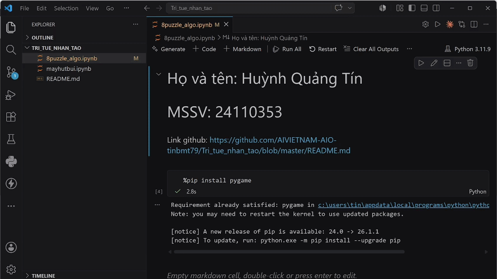

# BÀI TẬP VỀ NHÀ TRÍ TUỆ NHÂN TẠO
## Chủ đề bài tập
- Xây dựng AI Agent.
- Thực hành và hiểu các thuật toán tìm kiếm: Có thông tin và không có thông tin.
  + Có thông tin: BFS, DFS, IDS, ...
  + Không có thông tin: Greedy,...

## Cách sử dụng
- Mỗi bài tập được thực hiện trong file ipynb.
- Có thể nhiều bài tập gộp chung trong 1 file.
- Khi sử dụng, hãy nhấn "Run All" để có thể tải thư viện và chạy code.

## Giao diện

- Chọn thuật toán cần sử dụng.
- Ấn RUN.
- Các hành động của Agent sẽ được ghi lại trong Logs.
- Bàn cờ hiện tại đang là tạo ngẫu nhiên nên có thể xảy ra việc không tìm được đường đi, ấn "Trạng thái mới" để đổi bàn cờ.
- Ấn quay lại ban đầu để có thể sử dụng lại bàn cờ ban đầu để chạy thuật toán khác (so sánh hoạt động giữa các thuật toán)

## Hướng dẫn
 

